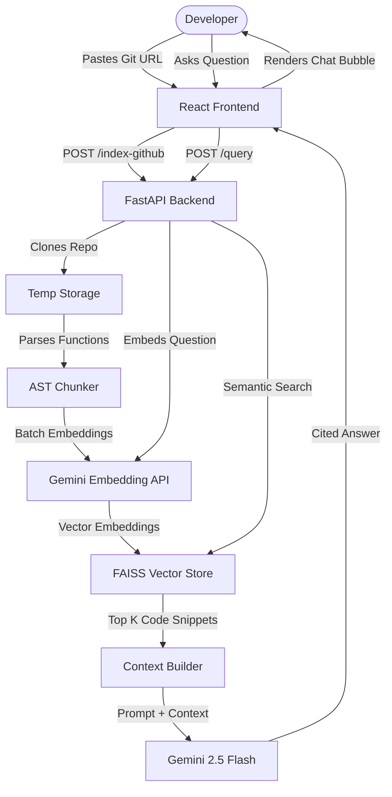

# Codebase Chat 🚀

Codebase Chat is a RAG (Retrieval-Augmented Generation) powered chatbot application designed to help developers explore, understand, and query Python repositories in plain English. 

By pasting a public GitHub repository URL, the system clones, chunks, indexes, and embeds the source code in real-time, allowing users to ask questions and receive answers cited with exact files, functions, and line numbers.

---

## 🌟 Key Features

*   **One-Click Repository Indexing**: Paste any public GitHub repository URL to trigger automated cloning and source parsing.
*   **AST-based Chunker**: Deconstructs Python source code files into functional blocks (functions and classes) using Python's Abstract Syntax Tree (AST), keeping context logically bounded.
*   **Highly Optimized Embedding Pipeline**: Integrates the new `google-genai` SDK and utilizes `models/gemini-embedding-001` with a **50x batching optimization** to calculate and store vector embeddings rapidly.
*   **In-Memory FAISS Vector Database**: Employs Facebook AI Similarity Search (FAISS) locally on the server for lightning-fast semantic code search.
*   **Source-Cited Answering**: The Gemini generative model answers user queries using only the relevant codebase context, outputting clear citations of the file name, function name, and line numbers.
*   **Premium Dark Mode Interface**: A sleek, responsive, glassmorphism-inspired UI designed for developers with markdown-like code block formatting.

---

## 🛠 Tech Stack

### Backend
*   **FastAPI**: A high-performance Python web framework for building the APIs.
*   **FAISS (faiss-cpu)**: A library for efficient similarity search and clustering of dense vectors.
*   **Google GenAI SDK**: Interacts with the Gemini APIs for calculating embeddings and generating codebase answers.
*   **GitPython**: Manages programmatic cloning of public Git repositories.
*   **Uvicorn**: An ASGI web server implementation for Python.

### Frontend
*   **React (v19)**: Component-based UI library.
*   **Vite**: Next-generation frontend tooling for fast development and bundle builds.
*   **CSS3**: Custom design tokens with modern glassmorphism panels, glowing states, and responsive styling.

---

## 🏗 System Architecture



---

## ⚙️ Configuration & Installation

### Prerequisites
*   Python 3.10+
*   Node.js 18+
*   Google AI Studio API Key ([Get one here](https://aistudio.google.com/))

### 1. Backend Setup

Clone the repository and navigate to the directory:
```bash
git clone https://github.com/yaswanth891/codebase-chat.git
cd codebase-chat
```

Create a virtual environment and activate it:
```bash
python -m venv venv
source venv/bin/activate  # On Windows: venv\Scripts\activate
```

Install requirements:
```bash
pip install -r requirements.txt
```

Create a `.env` file in the root directory:
```env
GEMINI_API_KEY=your_gemini_api_key_here
```

Start the FastAPI server:
```bash
uvicorn server:app --reload
```
The backend will be running at `http://127.0.0.1:8000`.

---

### 2. Frontend Setup

Navigate to the frontend folder:
```bash
cd frontend
```

Install dependencies:
```bash
npm install
```

Start the Vite dev server:
```bash
npm run dev
```
The frontend will be running at `http://localhost:5173`.

---

## 🚀 Production Deployment

### Backend (Render)
This project contains a `Procfile` configured for deployment on Render.
1. Create a new **Web Service** on Render connected to this GitHub repository.
2. Choose **Python** as the environment.
3. Set your environment variable:
    *   `GEMINI_API_KEY` = Your Google AI Studio API key
4. Deploy.

### Frontend (Vercel)
1. Create a new project on **Vercel** connected to this GitHub repository.
2. Set the root directory to `frontend`.
3. Set the environment variable:
    *   `VITE_API_URL` = Your deployed Render Backend URL (without a trailing slash)
4. Deploy.

---

## 📄 License
This project is open-source and available under the MIT License.
